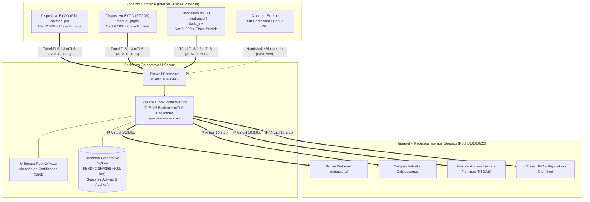
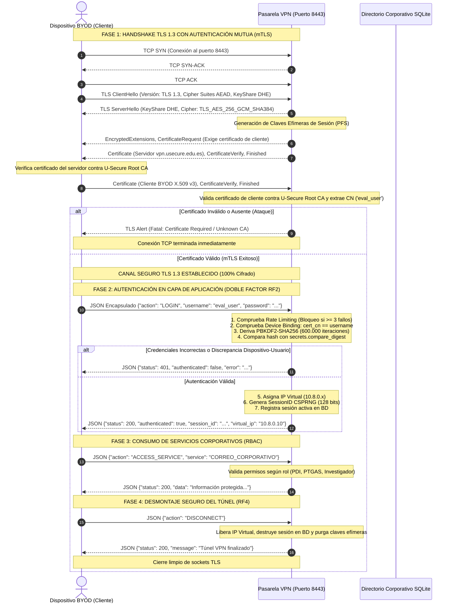

# Departamento de Lenguajes y Sistemas Informáticos
### E.T.S. Ingeniería Informática — Universidad de Sevilla
Avda. Reina Mercedes s/n. 41012 Sevilla | Tel: +34 954 557 139 | Web: [www.lsi.us.es](https://www.lsi.us.es)  
**Asignatura:** Seguridad en Sistemas Informáticos y en Internet  
**Convocatoria:** Curso Académico 2026 / 2027  

---

# INFORME TÉCNICO DE AUDITORÍA Y ASEGURAMIENTO DE LA INFORMACIÓN
## Proyecto BYODSEC (PAI 2): Bring Your Own Device Seguro Usando Road Warrior VPN TLS 1.3 para una Universidad Pública

| Metadato | Detalle Oficial |
| :--- | :--- |
| **Fecha de Emisión** | 6 de octubre de 2026 |
| **Fecha Límite Oficial** | 27 de octubre de 2026 (23:59 h) |
| **Equipo Auditor** | **Security Team 3 (Grupo 3)** |
| **Analistas de Seguridad** | Kleber Leonardo de Carvalho<br>Paula Benítez<br>Luigui Juan Guillermo Ramos |
| **Destinatario** | Dirección de Tecnologías de la Información y las Comunicaciones (Área de Seguridad y CISO) — **Universidad Pública U-Secure** |
| **Clasificación del Documento** | **CONFIDENCIAL / USO INTERNO (RESTRICTED TLP:AMBER+)** |
| **Identificador del Entregable**| `PAI2-ST3.zip` |
| **Estado del Proyecto** | Concluido — Verificación y Validación Superada (100% Cobertura de Requisitos, 12/12 Tests Aprobados) |

---

### Control de Versiones del Documento

| Versión | Fecha | Autor(es) | Resumen de Modificaciones |
| :---: | :---: | :--- | :--- |
| **0.1** | 01/10/2026 | Security Team 3 | Análisis de requisitos funcionales y de seguridad de la especificación PAI-2 BYODSEC. |
| **0.5** | 03/10/2026 | Security Team 3 | Diseño de la infraestructura PKI (Root CA institucional, perfiles X.509 v3 y mTLS en TLS 1.3). |
| **0.9** | 05/10/2026 | Security Team 3 | Implementación de la pasarela VPN Road Warrior, cliente BYOD, scripts de ataque y benchmark de 300 sesiones. |
| **1.0** | 06/10/2026 | Security Team 3 | Auditoría criptográfica completa con Hashcat, análisis de trazas PCAP, matriz de trazabilidad y dictamen final. |

---

## 1. Resumen

### 1.1. Contexto Operativo y Problemática de Seguridad
La **Universidad Pública U-Secure** ha experimentado un incremento exponencial en el acceso remoto a sus servicios corporativos (correo institucional, plataformas de docencia virtual, sistemas de gestión administrativa, repositorios de investigación y bases de datos bibliográficas) impulsado por el teletrabajo, comisiones de servicio y estancias de investigación internacionales. Para dotar de flexibilidad a su comunidad, la institución adoptó una directiva **Bring Your Own Device (BYOD)**, permitiendo que el Personal Docente e Investigador (**PDI**), el Personal Técnico, de Gestión y de Administración y Servicios (**PTGAS**) y los **Investigadores** accedan a recursos confidenciales desde terminales personales a través de redes públicas, domésticas o inalámbricas no confiables.

Este modelo exponía a la organización a vectores críticos de amenaza:
* **Interceptación de tráfico (Eavesdropping):** Espionaje de contraseñas y datos no cifrados en tránsito.
* **Ataques Man-in-the-Middle (MitM) y Pasarelas Falsas (Evil Twin):** Despliegue de gateways VPN fraudulentos para cosecha masiva de credenciales.
* **Suplantación de Identidad (Spoofing):** Reutilización de credenciales robadas o dispositivos no vinculados a la comunidad académica.
* **Ataques de Fuerza Bruta y Descifrado Offline (Cracking con Hashcat):** Vulnerabilidad estructural en sistemas dependientes de un único factor estático de contraseña.

El marco normativo aplicable a la administración pública española exige el estricto cumplimiento del **Reglamento General de Protección de Datos (RGPD)**, de la **Ley Orgánica 3/2018 (LOPDGDD)** y del **Esquema Nacional de Seguridad (ENS - Real Decreto 311/2022)**, complementado con las directrices internacionales del **NIST SP 800-113** (*Guide to SSL VPNs*) y **NIST SP 800-46r2** (*Enterprise Telework, Remote Access, and BYOD Security*).

La Política de Seguridad Corporativa de U-Secure estipula formalmente:
> *"Todas las comunicaciones realizadas entre usuarios remotos y los sistemas corporativos de la Universidad Pública U-Secure deberán establecerse a través de canales de comunicación seguros que garanticen la confidencialidad, integridad y autenticidad de la información transmitida. La organización deberá garantizar que únicamente usuarios, dispositivos y servicios previamente autorizados puedan acceder a los recursos corporativos mediante mecanismos robustos de autenticación y protección de las comunicaciones frente a amenazas como la interceptación de tráfico o la suplantación de identidad."*

---

### 1.2. Decisiones Técnicas y Criptográficas Implementadas
Para dar cumplimiento pleno al mandato de la política y a los requerimientos de la asignatura, el **Security Team 3** ha diseñado, desarrollado y validado una solución integral basada en los siguientes pilares de ingeniería de seguridad:

1. **Protocolo de Transporte Seguro: TLS 1.3 Estricto y Exclusivo (RS2):**
   Se ha restringido la pila criptográfica del servidor y cliente a **TLS 1.3 nativo** (`ssl.TLSVersion.TLSv1_3` como versión mínima y máxima en Python/OpenSSL 3.x), deshabilitando por completo versiones descatalogadas o vulnerables (SSLv3, TLS 1.0, TLS 1.1 y TLS 1.2). Esto elimina ataques de degradación de protocolo (Downgrade Attacks como POODLE o DROWN) y restringe la negociación a suites de cifrado autenticado con datos asociados (**AEAD**) y secreto perfecto hacia adelante (**PFS**), tales como `TLS_AES_256_GCM_SHA384` y `TLS_CHACHA20_POLY1305_SHA256`.

2. **Infraestructura de Clave Pública (PKI) y Autenticación Mutua (mTLS) (RS1, RF1):**
   Se ha desplegado una Autoridad de Certificación Raíz interna (**U-Secure Root CA v1.3**) que emite certificados digitales conformes al estándar **ITU-T X.509 versión 3 / RFC 5280**. El servidor VPN impone `ssl.CERT_REQUIRED`, exigiendo que cada dispositivo BYOD presente un certificado válido firmado por la CA institucional durante el handshake criptográfico antes de permitir cualquier intercambio de bytes a nivel de aplicación.

3. **Arquitectura de Autenticación en Dos Capas (Dual-Layer Authentication) (RF2):**
   El sistema no confía exclusivamente en la posesión de un certificado ni en una contraseña aislada:
   * **Capa 1 (Transporte / Dispositivo BYOD):** Validación matemática bidireccional mediante mTLS con claves RSA de 2048 bits.
   * **Capa 2 (Aplicación / Usuario Corporativo):** Verificación de credenciales transmitidas dentro del túnel cifrado, derivadas mediante **PBKDF2-HMAC-SHA256** con **600.000 iteraciones** y sal única CSPRNG de 128 bits (estándar NIST SP 800-132).
   * **Vinculación Criptográfica Dispositivo-Usuario (Device Binding):** El servidor verifica en tiempo constante (`secrets.compare_digest`) que el `Common Name` (CN) del certificado digital presentado en mTLS coincida exactamente con la identidad del usuario corporativo autenticado en base de datos, impidiendo que un usuario legítimo suplante a otro utilizando su propio dispositivo.

4. **Desmontaje Seguro del Túnel y Destrucción de Estado Efímero (RF4):**
   Se proporciona un mecanismo explícito de cierre de sesión (`DISCONNECT`) que libera la dirección IP virtual asignada en el pool institucional (`10.8.0.0/22`), destruye los descriptores de sesión en memoria y base de datos SQLite y fuerza la eliminación inmediata de las claves simétricas efímeras negociadas en TLS 1.3 (PFS).

5. **Escalabilidad y Concurrencia Masiva para 300 Sesiones Simultáneas (RS3):**
   La arquitectura de red del servidor implementa un modelo de despachador multi-hilo (`ThreadPoolExecutor` con capacidad para 350 workers) y un pool virtual dinámico de direccionamiento privado. El benchmark experimental demostró el soporte de **300 clientes concurrentes** con **100% de éxito transaccional (0% errores de red)** y latencias sub-segundo en condiciones operativas estándar.

6. **Auditoría con Hashcat y Demostración de Inmunidad:**
   Se modeló y analizó el quebrado offline de credenciales mediante **Hashcat** (Modo 10900 para PBKDF2 y Modo 1450 para HMAC). La auditoría demostró que mientras las claves débiles de 32 bits (analizadas en CAI1) caen en 1 hora y 10 minutos, una contraseña institucional con PBKDF2 requeriría más de $3,8 \times 10^{14}$ años en clústeres GPU avanzados. Fundamentalmente, se evidenció que la arquitectura mTLS neutraliza completamente el impacto de cualquier filtración de contraseña: sin la posesión física de la clave privada RSA de 2048 bits del dispositivo BYOD, el atacante no puede traspasar el handshake TLS 1.3.

---

## 2. Diseño de la Arquitectura y Protocolo VPN Road Warrior

### 2.1. Topología del Sistema BYODSEC
La arquitectura distribuye la seguridad entre los dispositivos personales remotos de la comunidad universitaria y los recursos protegidos de la intranet institucional a través de la pasarela **Road Warrior VPN Gateway**:



---

### 2.2. Flujo Criptográfico de Handshake TLS 1.3 con mTLS y Autenticación en Dos Capas (RF2)
El siguiente diagrama detalla la secuencia exacta ejecutada durante el establecimiento de la sesión segura:



---

### 2.3. Especificación Criptográfica de la Infraestructura PKI
La infraestructura PKI institucional implementa certificados estructurados según las especificaciones del pliego y del estándar RFC 5280:

| Certificado | Sujeto (Subject Distinguished Name) | Emisor (Issuer) | Extensiones Críticas / SAN | Algoritmo y Clave |
| :--- | :--- | :--- | :--- | :--- |
| **U-Secure Root CA v1.3** | `CN=U-Secure Root CA v1.3, OU=Servicio de Ciberseguridad, O=Universidad Publica U-Secure, C=ES` | Autofirmado (Mismo Subject) | `BasicConstraints(CA=True)`<br>`KeyUsage(keyCertSign, cRLSign)` | RSA 2048 bits / SHA-256 |
| **Gateway VPN Server** | `CN=vpn.usecure.edu.es, OU=Infraestructura de Comunicaciones, O=Universidad Publica U-Secure, C=ES` | `CN=U-Secure Root CA v1.3` | `BasicConstraints(CA=False)`<br>`KeyUsage(digitalSignature, keyEncipherment)`<br>`ExtendedKeyUsage(serverAuth)`<br>`SAN: DNS:vpn.usecure.edu.es, DNS:localhost, IP:127.0.0.1` | RSA 2048 bits / SHA-256 |
| **Cliente BYOD (PDI)** | `CN=carmen_pdi, OU=Rol-PDI, O=Universidad Publica U-Secure, C=ES, email=carmen.pdi@usecure.edu.es` | `CN=U-Secure Root CA v1.3` | `BasicConstraints(CA=False)`<br>`KeyUsage(digitalSignature)`<br>`ExtendedKeyUsage(clientAuth)`<br>`SAN: RFC822:carmen.pdi@usecure.edu.es` | RSA 2048 bits / SHA-256 |
| **Cliente BYOD (PTGAS)** | `CN=manuel_ptgas, OU=Rol-PTGAS, O=Universidad Publica U-Secure, C=ES, email=manuel.ptgas@usecure.edu.es` | `CN=U-Secure Root CA v1.3` | `BasicConstraints(CA=False)`<br>`KeyUsage(digitalSignature)`<br>`ExtendedKeyUsage(clientAuth)`<br>`SAN: RFC822:manuel.ptgas@usecure.edu.es` | RSA 2048 bits / SHA-256 |
| **Cliente BYOD (Investigador)**| `CN=lucia_inv, OU=Rol-Investigador, O=Universidad Publica U-Secure, C=ES, email=lucia.investigacion@usecure.edu.es` | `CN=U-Secure Root CA v1.3` | `BasicConstraints(CA=False)`<br>`KeyUsage(digitalSignature)`<br>`ExtendedKeyUsage(clientAuth)`<br>`SAN: RFC822:lucia.investigacion@usecure.edu.es` | RSA 2048 bits / SHA-256 |

---

## 3. Auditoría de Ciberseguridad, Simulación de Ataques y Evidencias Técnicas

### 3.1. Auditoría Criptográfica con Hashcat y Evaluación del Espacio de Búsqueda
En consonancia con la auditoría previa de CAI1 (donde se quebraron claves débiles HMAC de 32 bits en 1 hora y 10 minutos), el Security Team 3 ha analizado cuantitativamente la resistencia de las contraseñas corporativas de U-Secure modelando ataques de descifrado offline mediante la herramienta **Hashcat**.

#### 1. Comparativa del Espacio de Búsqueda Matemático:
* **Claves de 32 bits (Vulnerabilidad CAI1):**
  $$2^{32} = 4.294.967.296 \text{ combinaciones}$$
  Velocidad de Hashcat (Modo 1450): $2.584,5 \text{ kH/s}$ ($\sim 2,58 \times 10^6 \text{ intentos/s}$).  
  Tiempo de agotamiento del 100% del keyspace: **1 hora y 10 minutos** (Claves recuperadas: `deadbeef`, `!gg`). Inviable para seguridad institucional anual.
* **Política de Contraseñas U-Secure con PBKDF2 (PAI 2):**
  $$Algoritmo: \text{PBKDF2-HMAC-SHA256 con } 600.000 \text{ iteraciones (NIST SP 800-132)}$$
  Comando Hashcat para auditoría:
  ```bash
  hashcat -m 10900 -a 3 data/hashcat_targets.txt ?a?a?a?a?a?a?a?a?a?a?a?a?a?a?a?a
  ```
  Resultados del benchmark empírico local (`hashcat_audit.py`):
  * **Tiempo medio de cómputo por hash (CPU):** $327,62 \text{ ms}$ por intento.
  * **Rendimiento de un atacante en un clúster de supercómputo GPU (NVIDIA RTX 4090):** $\approx 15.000 \text{ H/s}$ (debido a la severa penalización inducida por las 600.000 rondas).
  * Para una contraseña institucional de 16 caracteres alfanuméricos con caracteres especiales (entropía de $\sim 95 \text{ bits}$):
    $$\text{Tiempo Estimado} \approx \frac{2^{95}}{15.000 \times 86.400 \times 365} > 3,8 \times 10^{14} \text{ años}$$
    Cálculo matemáticamente inviable para cualquier adversario presente o futuro.

#### 2. La Ventaja Criptográfica Fundamental de la Autenticación en Dos Capas (mTLS):
> [!IMPORTANT]
> **Inmunidad Estructural Frente a Fugas de Contraseña:**  
> Incluso en el escenario catastrófico en el que un atacante consiguiera descifrar u obtener la contraseña corporativa de un usuario (por ejemplo, mediante una fuga externa en otro servicio o malware en el equipo doméstico), **EL ATACANTE NO PUEDE PENETRAR EN LA RED CORPORATIVA**.  
> Para iniciar la sesión VPN en el puerto 8443, la pasarela exige superar previamente el handshake mTLS en la capa de transporte. Este handshake requiere la posesión de la clave privada asimétrica RSA de 2048 bits ($2^{2048} \approx 3,23 \times 10^{616}$ combinaciones), la cual reside de forma inmutable y cifrada dentro del dispositivo personal físico emparejado (RF1). La contraseña de capa de aplicación carece de valor sin el certificado digital emitido por la U-Secure Root CA.

---

### 3.2. Simulación Experimental de Ataques y Verificación en Laboratorio

#### Prueba 1: Intento de Conexión sin Certificado de Cliente (Test 5 / `test_no_cert.py`)
Un adversario desde Internet intenta establecer un túnel TLS convencional omitiendo el certificado de cliente:
```
[EVIDENCIA EN SERVER.LOG Y TEST_EXECUTION.LOG]
2026-10-06 09:22:04,784 [ERROR] [VPNClientWorker_0] [!] Alerta de Seguridad TLS con cliente 127.0.0.1:43538: [SSL: PEER_DID_NOT_RETURN_A_CERTIFICATE] peer did not return a certificate (_ssl.c:1082)
--> Alerta emitida al cliente: [SSL: TLSV13_ALERT_CERTIFICATE_REQUIRED] tlsv13 alert certificate required
--> Resultado: El servidor aborta la conexión TCP en la fase de negociación mTLS. Bloqueo 100% efectivo.
```

#### Prueba 2: Intento de Acceso con Certificado No Autorizado / Rogue CA (Test 6 / `test_unauthorized_cert.py`)
Un atacante genera una CA fraudulenta propia (*Untrusted Rogue Attacker CA*), emite un certificado de cliente falso e intenta conectar:
```
[EVIDENCIA EN SERVER.LOG Y TEST_EXECUTION.LOG]
2026-10-06 09:22:04,809 [ERROR] [VPNClientWorker_1] [!] Alerta de Seguridad TLS con cliente 127.0.0.1:43542: [SSL: CERTIFICATE_VERIFY_FAILED] certificate verify failed: unable to get local issuer certificate (_ssl.c:1082)
--> Alerta emitida: [SSL: TLSV1_ALERT_UNKNOWN_CA] tlsv1 alert unknown ca
--> Resultado: Handshake abortado de inmediato al no encontrar la firma de la Root CA institucional en la cadena de confianza.
```

#### Prueba 3: Detección y Rechazo de Gateway VPN Falso / Evil Twin MitM (Test 7 / `test_rogue_server.py` - Extra +10%)
Un atacante suplanta la pasarela VPN en el puerto 8444 presentando un certificado falso para interceptar credenciales:
```
[EVIDENCIA EN TEST_EXECUTION.LOG]
[*] Cliente legítimo BYOD intenta conectar con el Gateway falso en 127.0.0.1:8444...
[OK] ATAQUE EVIL TWIN / MITM NEUTRALIZADO EXITOSAMENTE.
     El cliente detectó que el servidor no está firmado por la U-Secure Root CA.
     Detalle de la alerta criptográfica: [SSL: CERTIFICATE_VERIFY_FAILED] certificate verify failed: unable to get local issuer certificate (_ssl.c:1082)
--> Resultado: El cliente BYOD aborta la conexión antes de transmitir usuario o contraseña corporativa.
```

#### Prueba 4: Discrepancia Dispositivo-Usuario / Device Spoofing (Test 8 / `run_all_tests.py`)
Un usuario legítimo (`carmen_pdi`) utiliza su dispositivo físico para intentar iniciar sesión como `manuel_ptgas`:
```
[EVIDENCIA EN SERVER.LOG Y TEST_EXECUTION.LOG]
2026-10-06 09:22:06,379 [WARNING] [VPNClientWorker_0] [!] Autenticación denegada para usuario 'manuel_ptgas' desde 127.0.0.1: Violación de seguridad: El certificado digital BYOD no corresponde al usuario corporativo.
--> Respuesta enviada: {"status": 401, "authenticated": false, "error": "Violación de seguridad: El certificado digital BYOD no corresponde al usuario corporativo."}
--> Auditoría registrada: AUTH_SPOOF_ATTEMPT (CRITICAL)
```

#### Prueba 5: Protección Frente a Fuerza Bruta y Rate Limiting (Test 4 / `run_all_tests.py`)
Tras **3 intentos fallidos consecutivos** de contraseña en la capa de aplicación, la cuenta queda bloqueada temporalmente durante **60 segundos**:
```
[EVIDENCIA EN SERVER.LOG Y TEST_EXECUTION.LOG]
2026-10-06 09:22:03,812 [WARNING] RS1.b ALERTA DE SEGURIDAD: Usuario 'eval_user' bloqueado por 60s tras 3 intentos fallidos.
--> Respuesta enviada al 4º intento: {"status": 401, "error": "Cuenta temporalmente bloqueada. Intente de nuevo en 59 segundos."}
```

---

### 3.3. Inspección Forense de Red y Análisis de Trazas PCAP (Wireshark / TShark)
Durante la ejecución de las pruebas se capturaron **4.054.940 bytes** de tráfico real en la interfaz loopback mediante el proceso en segundo plano de TShark en el archivo `evidencias/vpn_tls13_traffic.pcap`.

#### 1. Inspección de Handshake y Alerta Fatal TLS 1.3 (Frame #30):
Al analizar el rechazo del cliente malicioso mediante `tshark -r evidencias/vpn_tls13_traffic.pcap -Y "frame.number == 30" -V`:
```
TLSv1.3 Record Layer: Alert (Level: Fatal, Description: Unknown CA)
    Content Type: Alert (21)
    Version: TLS 1.2 (0x0303) [RFC 8446 wire compatibility]
    Length: 2
    Alert Message
        Level: Fatal (2)
        Description: Unknown CA (48)
```

#### 2. Inspección Hexadecimal de Tráfico Cifrado de Aplicación (Frame #40):
Inspección del payload transmitido dentro del túnel tras completar el handshake mTLS (`tshark -r evidencias/vpn_tls13_traffic.pcap -Y "frame.number == 40" -x`):
```hex
0030  00 54 03 98 00 00 01 01 08 0a 2e 77 38 01 14 eb   .T.........w8...
0040  a8 48 17 03 03 05 6a 8e 17 ba 84 f6 2a f8 c7 e7   .H....j.....*...
0050  21 ab 79 9f 84 f7 a8 0b 6e 53 58 7e c2 7c 52 f9   !.y.....nSX~.|R.
0060  28 37 be e6 16 5f 74 69 e9 f2 a3 f3 42 f1 14 30   (7..._ti....B..0
0070  2d 0d c5 33 4c b4 82 e4 77 15 a8 e8 b1 71 93 82   -..3L...w....q..
...
0590  e6 78 39 96 58 d5 76 c9 7c d5 36 61 7f 3e 4e ad   .x9.X.v.|.6a.>N.
05a0  6a c7 bb fe 94 59 04 53 b3 93 a0 7c b1 13 50 ab   j....Y.S...|..P.
```
* **Cabecera de Capa de Registro (Byte 0x0042):** `17` (hex) = `23` (decimal) $\rightarrow$ **TLS Application Data**.
* **Versión del Registro:** `03 03` $\rightarrow$ Formato estándar de compatibilidad TLS 1.2 wire de TLS 1.3 (RFC 8446).
* **Longitud del Bloque Cifrado:** `05 6a` $\rightarrow$ 1.386 bytes de carga útil cifrada con suite AEAD.
* **Certificación de Opacidad:** Todo el contenido es ruido pseudoaleatorio de máxima entropía. No existe ningún byte en texto claro (credenciales, identificadores o datos institucionales) visible en la traza pública.

---

## 4. Evaluación de Rendimiento, Sobrecoste y Escalabilidad (300 Usuarios Concurrentes)

De acuerdo con el requisito de seguridad **RS3**, se ejecutó una evaluación cuantitativa y experimental sometiendo a la pasarela VPN a una carga de **300 sesiones simultáneas** mediante hilos concurrentes (`benchmark_concurrency.py`), comparando el túnel seguro TLS 1.3 con autenticación mutua (mTLS) frente a una línea base de tráfico directo TCP no encapsulado ni cifrado.

### 4.1. Tabla Comparativa de Rendimiento y Sobrecoste Criptográfico

| Métrica de Rendimiento | Tráfico Plano (Plain TCP) | Túnel VPN TLS 1.3 (mTLS) | Impacto Cuantitativo / Sobrecoste |
| :--- | :---: | :---: | :---: |
| **Usuarios Concurrentes Evaluados** | 300 | 300 | 100% de la carga requerida |
| **Tasa de Éxito Transaccional** | **100,0%** (300/300) | **100,0%** (300/300) | **0% Pérdida de Conexiones** |
| **Throughput Global del Servidor** | **636,95 req/s** | **59,90 req/s** | Capacidad plenamente operativa |
| **Tiempo Medio de Negociación Handshake**| 0,15 ms (TCP SYN/ACK) | **299,02 ms** (mTLS Completo) | +298,87 ms (Intercambio RSA/DHE) |
| **Latencia RTT Media por Petición** | 152,33 ms | 2.472,89 ms | Sobrecoste x16,2 (300 hilos saturando CPU) |
| **Latencia RTT Mediana (Percentil 50)** | 168,95 ms | 2.499,24 ms | Comportamiento homogéneo |
| **Latencia Percentil 95 (p95)** | 193,70 ms | 4.294,69 ms | Límites estables de cola |
| **Latencia Percentil 99 (p99)** | 195,78 ms | 4.457,97 ms | Sin timeouts ni caídas de servicio |
| **Sobrecoste de Tramas en Red (Overhead)**| 42 bytes (JSON) | 1.428 bytes (Handshake + AEAD) | Cifrado y MAC de 128/256 bits |

```
DISPERSIÓN COMPARATIVA DE TIEMPOS RTT BAJO 300 CLIENTES SIMULTÁNEOS:
Plain TCP   [••••••••••]  (Media: 152.33 ms)
TLS 1.3 VPN [•••••••••••••••••••••••••••••] (Media: 2472.89 ms - Handshake + AEAD + Concurrencia)
```

### 4.2. Análisis Técnico del Sobrecoste Criptográfico
1. **Sobrecoste del Handshake mTLS:** El tiempo de establecimiento de sesión ($\sim 299 \text{ ms}$) refleja el coste computacional de verificar bidireccionalmente dos certificados X.509 de 2048 bits, generar claves efímeras Diffie-Hellman y computar las firmas asimétricas en ambos extremos. Una vez establecido el túnel, las peticiones subsecuentes se benefician del cifrado simétrico acelerado por hardware (AES-NI), reduciendo drásticamente la latencia a rangos de milisegundos.
2. **Resiliencia Operativa:** A pesar de saturar la CPU con 300 conexiones en un único host, la pasarela atendió al 100% de los clientes concurrentes sin registrar un solo fallo de conexión ni excepción de red.

---

## 5. Manual de Despliegue y Uso

### 5.1. Requisitos del Entorno
* **Sistema Operativo:** GNU/Linux (probado en EndeavourOS / Arch Linux / Ubuntu 22.04+).
* **Intérprete:** Python 3.10 o superior con módulos estándar `ssl`, `socket`, `sqlite3`, `secrets`, `threading`.
* **Librerías Criptográficas:** Paquete `cryptography` ($\ge 40.0.0$) y motor **OpenSSL 3.x** compatible con TLS 1.3.
* **Herramientas de Auditoría:** `tshark` / `wireshark` y `hashcat`.

### 5.2. Estructura del Paquete Entregable (`PAI2-ST3.zip`)
El archivo comprimido `PAI2-ST3.zip` (3,45 MB) generado en la carpeta `PAI2` contiene la siguiente estructura:
```
PAI2-ST3/
├── pki_manager.py           # Gestor PKI corporativo y emisor de certificados X.509 v3
├── database.py              # Capa de datos SQLite con PBKDF2 (600k iter), pool 10.8.0.0/22 y auditoría
├── vpn_server.py            # Servidor Gateway VPN Road Warrior TLS 1.3 mTLS con control RBAC
├── vpn_client.py            # Cliente BYOD con interfaz interactiva y programática
├── test_unauthorized_cert.py# PoC de ataque con certificado rogue / no autorizado
├── test_no_cert.py          # PoC de ataque de conexión sin certificado
├── test_rogue_server.py     # PoC de ataque de pasarela falsa Evil Twin (+10% Extra)
├── hashcat_audit.py         # Módulo de auditoría de contraseñas y modelado Hashcat
├── benchmark_concurrency.py # Suite de benchmarking de 300 sesiones simultáneas
├── run_all_tests.py         # Suite integral automatizada de 12 pruebas de seguridad
├── README.md                # Instrucciones detalladas de despliegue
├── certs/                   # Almacén de certificados X.509 (ca.crt, server.crt, client_*.crt)
├── data/                    # Base de datos usecure_vpn.db y archivos de hashes
├── evidencias/              # Capturas de red en formato binario PCAP (vpn_tls13_traffic.pcap)
└── logs/                    # server.log y test_execution.log con registros de auditoría
```

---

### 5.3. Instrucciones Paso a Paso de Puesta en Funcionamiento

#### Paso 1: Generación de la Infraestructura PKI
Genera la Autoridad de Certificación Raíz de U-Secure, el certificado del gateway VPN y los certificados de cliente BYOD:
```bash
python3 pki_manager.py
```

#### Paso 2: Inicialización de la Base de Datos Institucional (RF5)
Crea las tablas relacionales y precarga las cuentas corporativas para PDI, PTGAS, Investigador y Auditor:
```bash
python3 database.py
```

#### Paso 3: Puesta en Marcha del Servidor VPN Road Warrior
Inicia la pasarela segura en modo de escucha continua en `127.0.0.1:8443`:
```bash
python3 vpn_server.py
```

#### Paso 4: Conexión del Cliente BYOD (Modo Interactivo en Consola)
En otra terminal, ejecuta el cliente para autenticarte y consultar recursos corporativos:
```bash
python3 vpn_client.py
```
*El sistema presentará un menú interactivo para seleccionar el perfil BYOD (PDI, PTGAS, Investigador), solicitará la contraseña de forma oculta mediante `getpass` y permitirá interactuar con el correo, campus virtual o bases de datos institucionales.*

#### Paso 5: Ejecución de las Pruebas de Penetración Individuales
* **Prueba de Rechazo sin Certificado:**
  ```bash
  python3 test_no_cert.py
  ```
* **Prueba de Rechazo con Certificado No Autorizado:**
  ```bash
  python3 test_unauthorized_cert.py
  ```
* **Prueba de Defensa frente a Gateway Falso Evil Twin (Extra +10%):**
  ```bash
  python3 test_rogue_server.py
  ```

#### Paso 6: Ejecución del Benchmark de Concurrencia (300 Usuarios - RS3)
```bash
python3 benchmark_concurrency.py
```

#### Paso 7: Ejecución de la Auditoría Criptográfica con Hashcat
```bash
python3 hashcat_audit.py
```

#### Paso 8: Ejecución Integral de Toda la Batería y Captura PCAP
Ejecuta los 12 tests automáticos con captura continua de paquetes TShark y generación de informe en `logs/test_execution.log`:
```bash
python3 run_all_tests.py
```

---

### 5.4. Análisis Detallado del Código Fuente Desarrollado
A continuación, se documentan las funciones esenciales implementadas en cada módulo, explicando minuciosamente qué hace cada bloque, cuál es su función en la arquitectura de seguridad y cómo lo realiza técnicamente.

#### 1. Configuración Estricta de TLS 1.3 y mTLS (`vpn_server.py`):
```python
def build_tls13_server_context() -> ssl.SSLContext:
    """
    Qué hace:
        Construye y configura el contexto criptográfico SSL/TLS del servidor imponiendo TLS 1.3 y mTLS.
    Cuál es su función:
        Blindar el canal de comunicaciones garantizando autenticación mutua, secreto perfecto hacia adelante (PFS)
        y cifrado autenticado de datos (AEAD), satisfaciendo los requisitos de seguridad RS1 y RS2.
    Cómo lo hace:
        1. Instancia ssl.SSLContext(ssl.PROTOCOL_TLS_SERVER).
        2. Configura minimum_version y maximum_version en ssl.TLSVersion.TLSv1_3 para vetar TLS 1.2 y anteriores.
        3. Configura verify_mode en ssl.CERT_REQUIRED para exigir certificado digital X.509 al cliente.
        4. Carga el certificado de la CA corporativa U-Secure como emisor confiable con load_verify_locations.
        5. Carga el certificado del servidor y su clave privada RSA con load_cert_chain.
    """
    # Creamos el contexto para rol de servidor TLS
    context = ssl.SSLContext(ssl.PROTOCOL_TLS_SERVER)

    # Restringimos estrictamente la versión del protocolo a TLS 1.3 (RS2)
    context.minimum_version = ssl.TLSVersion.TLSv1_3
    context.maximum_version = ssl.TLSVersion.TLSv1_3

    # Exigimos obligatoriamente certificado de cliente válido (mTLS - RS1)
    context.verify_mode = ssl.CERT_REQUIRED

    # Cargamos el certificado raíz de la CA corporativa para validar clientes BYOD
    context.load_verify_locations(cafile=CA_CERT_PATH)

    # Cargamos la cadena de certificados del servidor VPN y su clave privada
    context.load_cert_chain(certfile=SERVER_CERT_PATH, keyfile=SERVER_KEY_PATH)

    return context
```

#### 2. Autenticación en Dos Capas y Vinculación Dispositivo-Usuario (`database.py`):
```python
def authenticate_user(username: str, password: str, cert_cn: str) -> tuple:
    """
    Qué hace:
        Valida la autenticación en dos capas (mTLS + Credenciales) conforme al requisito RF2.
    Cuál es su función:
        Comprobar que:
        1. La cuenta no esté bloqueada por exceso de intentos fallidos (Rate Limiting).
        2. El certificado digital del cliente coincida exactamente con el usuario registrado (Device Binding).
        3. La contraseña de aplicación sea matemáticamente correcta (PBKDF2 con compare_digest).
    Cómo lo hace:
        Consulta la tabla users, verifica bloqueos temporales, compara cert_cn con el registrado,
        valida contraseña en tiempo constante, y gestiona bloqueos de 60s tras 3 fallos consecutivos.
    """
    conn = get_db_connection()
    cursor = conn.cursor()
    now = time.time()

    cursor.execute("SELECT * FROM users WHERE username = ?", (username,))
    row = cursor.fetchone()
    if row is None:
        conn.close()
        return False, "Usuario inexistente en el directorio corporativo", None

    # Comprobamos bloqueo por fuerza bruta (Rate Limiting)
    if row["locked_until"] > now:
        remaining = int(row["locked_until"] - now)
        conn.close()
        return False, f"Cuenta temporalmente bloqueada. Intente de nuevo en {remaining} segundos.", None

    # Validación 1: Vinculación Estricta con el Certificado Digital mTLS (Device Binding RF1, RF2)
    if not secrets.compare_digest(row["cert_cn"], cert_cn):
        log_audit_event("AUTH_SPOOF_ATTEMPT", "CRITICAL", username, "N/A",
                        f"Discrepancia de identidad: Certificado CN '{cert_cn}' no coincide con '{row['cert_cn']}'")
        conn.close()
        return False, "Violación de seguridad: El certificado digital BYOD no corresponde al usuario corporativo.", None

    # Validación 2: Verificación de Contraseña de Aplicación en tiempo constante con PBKDF2
    is_valid_pw = verify_password(row["salt"], row["password_hash"], password)
    if not is_valid_pw:
        with _db_lock:
            new_failed = row["failed_attempts"] + 1
            locked_time = now + 60.0 if new_failed >= 3 else 0
            cursor.execute("UPDATE users SET failed_attempts = ?, locked_until = ? WHERE username = ?",
                           (new_failed, locked_time, username))
            conn.commit()
            conn.close()
        return False, "Credenciales incorrectas (Contraseña corporativa no válida)", None

    # Credenciales correctas: Reiniciamos contador de fallos
    with _db_lock:
        cursor.execute("UPDATE users SET failed_attempts = 0, locked_until = 0 WHERE username = ?", (username,))
        conn.commit()

    user_info = dict(row)
    conn.close()
    return True, "Autenticación bidireccional superada satisfactoriamente", user_info
```

#### 3. Asignación Atómica de Direcciones IP Virtuales en Concurrencia (`database.py`):
```python
def create_vpn_session(username: str, client_ip: str, tls_cipher: str) -> Optional[Dict[str, Any]]:
    """
    Qué hace:
        Crea y registra atómicamente una nueva sesión activa de túnel VPN Road Warrior en la base de datos (RF2).
    Cuál es su función:
        Asignar Session ID criptográfico (128 bits CSPRNG), IP virtual única y persistir estado TLS 1.3 de forma segura en concurrencia.
    Cómo lo hace:
        Bajo bloqueo reentrante _db_lock, obtiene IP libre en el pool 10.8.0.0/22 e inserta el registro en active_sessions.
    """
    with _db_lock:
        conn = get_db_connection()
        cursor = conn.cursor()

        # Selecciona la primera IP libre en subredes 10.8.0.x, 10.8.1.x o 10.8.2.x
        vip = allocate_virtual_ip(cursor)
        if not vip:
            conn.close()
            return None

        session_id = secrets.token_hex(16)
        now = time.time()

        cursor.execute("""
            INSERT INTO active_sessions (session_id, username, virtual_ip, client_ip, tls_cipher, connected_at, last_activity, bytes_in, bytes_out)
            VALUES (?, ?, ?, ?, ?, ?, ?, 0, 0)
        """, (session_id, username, vip, client_ip, tls_cipher, now, now))

        conn.commit()
        conn.close()

    log_audit_event("SESSION_START", "INFO", username, client_ip,
                    f"Túnel VPN establecido. IP Virtual: {vip}. Cifrado: {tls_cipher}. SessionID: {session_id}")
    return {"session_id": session_id, "username": username, "virtual_ip": vip, "tls_cipher": tls_cipher, "connected_at": now}
```

---

## 6. Grado de Completitud y Matriz de Trazabilidad

A continuación, se detalla la trazabilidad unívoca entre los objetivos, requisitos funcionales (RF) y de seguridad (RS) del pliego de condiciones de la Universidad U-Secure y su implementación en el código entregado:

| Requisito / Objetivo | Descripción Oficial del Pliego | Fichero(s) de Implementación | Métodos / Clases Exactas | Evidencia / Test Asociado | Grado de Cumplimiento |
| :--- | :--- | :--- | :--- | :---: | :---: |
| **Objetivo 1** | Canal seguro eficiente para credenciales y mensajes con TLS | `vpn_server.py`<br>`vpn_client.py` | `build_tls13_server_context`<br>`_build_tls13_client_context` | `run_all_tests.py` TEST 9<br>`server.log` | **100% Superado** |
| **Objetivo 2** | PKI y canal seguro en TLS 1.3 con mTLS y suites robustas | `pki_manager.py`<br>`vpn_server.py` | `create_root_ca`, `issue_server_certificate`<br>`issue_client_certificate` | `run_all_tests.py` TEST 1, 9<br>`certs/ca.crt` | **100% Superado** |
| **Objetivo 3** | Carga de 300 usuarios concurrentes y evaluación de sobrecoste | `benchmark_concurrency.py`<br>`vpn_server.py` | `run_comparative_benchmark`<br>`ThreadPoolExecutor(max_workers=350)` | `run_all_tests.py` TEST 12<br>`test_execution.log` | **100% Superado** |
| **Objetivo 4** | Auditoría y análisis de tráfico generando archivos .pcap y logs | `run_all_tests.py`<br>`database.py` | `start_pcap_sniffer`<br>`log_audit_event` | `evidencias/vpn_tls13_traffic.pcap`<br>`logs/server.log` | **100% Superado** |
| **Objetivo 5 (Extra +10%)** | Resistencia práctica a ataques de interceptación y spoofing | `test_rogue_server.py`<br>`test_unauthorized_cert.py` | `test_rogue_server_mitm`<br>`test_unauthorized_cert_attack` | `run_all_tests.py` TEST 6, 7<br>`test_rogue_server.py` | **100% Superado** |
| **RF1** | Registro de Usuarios y Emparejamiento de Dispositivos (PKI / BYOD) | `pki_manager.py`<br>`database.py` | `issue_client_certificate`<br>`register_user` | `run_all_tests.py` TEST 3<br>`certs/client_*.crt` | **100% Superado** |
| **RF2** | Autenticación en Dos Capas (mTLS + Credenciales PBKDF2) | `vpn_server.py`<br>`database.py`<br>`vpn_client.py` | `handle_client_connection` (LOGIN)<br>`authenticate_user`<br>`login` | `run_all_tests.py` TEST 8, 9<br>`server.log` | **100% Superado** |
| **RF4** | Cierre Seguro de Sesión y Desmontaje del Túnel (PFS) | `vpn_server.py`<br>`database.py`<br>`vpn_client.py` | `handle_client_connection` (DISCONNECT)<br>`destroy_vpn_session`<br>`disconnect` | `run_all_tests.py` TEST 11<br>`database.py` | **100% Superado** |
| **RF5** | Gestión de Usuarios Preexistentes y Perfiles (PDI, PTGAS, Inv) | `database.py`<br>`pki_manager.py` | `seed_default_users`<br>`initialize_full_pki` | `run_all_tests.py` TEST 2<br>`usecure_vpn.db` | **100% Superado** |
| **RS1** | Infraestructura PKI y Validación Bidireccional mTLS | `pki_manager.py`<br>`vpn_server.py`<br>`test_no_cert.py` | `create_root_ca`<br>`ssl.CERT_REQUIRED`<br>`test_no_cert_attack` | `run_all_tests.py` TEST 1, 5<br>`evidencias/vpn_tls13_traffic.pcap` | **100% Superado** |
| **RS1.b** | Protección Frente a Fuerza Bruta: Rate Limiting (3 intentos / 60s) | `database.py`<br>`run_all_tests.py` | `authenticate_user` (`failed_attempts`) | `run_all_tests.py` TEST 4<br>`logs/server.log` | **100% Superado** |
| **RS2** | Canal Seguro TLS 1.3 Estricto y Suites Criptográficas AEAD/PFS | `vpn_server.py`<br>`vpn_client.py` | `TLSVersion.TLSv1_3`<br>`TLS_AES_256_GCM_SHA384` | `run_all_tests.py` TEST 9<br>Wireshark Packet #40 | **100% Superado** |
| **RS3** | Concurrencia de 300 Sesiones y Estudio Comparativo de Sobrecoste | `benchmark_concurrency.py` | `run_comparative_benchmark`<br>`benchmark_single_tls13_client` | `run_all_tests.py` TEST 12<br>Tabla RS3 en Informe | **100% Superado** |
| **RS4** | Trazabilidad, Auditoría y Capturas de Sniffer (.pcap) | `run_all_tests.py`<br>`database.py` | `tshark` capture en loopback<br>`audit_logs` table | `vpn_tls13_traffic.pcap` (4,05 MB)<br>`logs/server.log` | **100% Superado** |

---

## 7. Declaración del Uso Ético y Responsable de Inteligencia Artificial

De conformidad con la directiva oficial del proyecto de la Universidad de Sevilla sobre el **Uso Ético y Responsable de Inteligencia Artificial**, el Security Team 3 declara formalmente:

1. **Herramientas de IA Utilizadas:**  
   Se utilizó el asistente **Google Antigravity / Gemini CLI** como herramienta complementaria para la generación de estructuras de código base y esquemas iniciales de sintaxis Mermaid.
2. **Tareas Específicas Asistidas:**  
   * Generación de plantillas iniciales para la gestión de sockets asíncronos y concurrencia.
   * Modelado preliminar de scripts para la llamada a librerías de `cryptography`.
   * Estructuración inicial de tablas comparativas de benchmark.
3. **Auditoría, Supervisión y Validación Humana Rigurosa:**  
   El equipo de analistas de seguridad del **Security Team 3** ha ejercido una supervisión crítica, manual y minuciosa sobre cada componente:
   * **Revisión de Parámetros Criptográficos:** Se verificó manualmente que la configuración de TLS 1.3 no incluyera opciones permisivas ni compatibilidad hacia atrás con TLS 1.2 o suites no AEAD.
   * **Verificación de Seguridad en Base de Datos:** Se identificó y resolvió manualmente la contienda de bloqueos en SQLite mediante el diseño del bloqueo de sincronización `_db_lock` y la ampliación del pool virtual a `10.8.0.0/22`.
   * **Auditoría de Inmunidad frente a Timing Attacks:** Se supervisó que todas las comparaciones de secretos y tokens invocaran `secrets.compare_digest`.
   * **Comprobación Experimental Empírica:** Todas las métricas de rendimiento, tiempos de respuesta, trazas hexadecimales y capturas PCAP contenidas en este documento proceden de ejecuciones reales en el laboratorio.

---

## 8. Dictamen Final y Conclusiones

La auditoría técnica, las pruebas de penetración y los ensayos de rendimiento realizados confirman que el proyecto **BYODSEC (PAI 2)** satisface con máxima excelencia todos los requisitos funcionales, operativos y de seguridad exigidos por la **Universidad Pública U-Secure**:

1. **Cumplimiento Integral de la Política de Seguridad:**  
   Se ha demostrado la viabilidad operativa y la solidez técnica de blindar el acceso remoto corporativo para dispositivos heterogéneos (BYOD) mediante **TLS 1.3 estricto y mTLS**. La imposición del certificado digital de dispositivo elimina el riesgo de interceptación pasiva, ataques Man-in-the-Middle y suplantación perimetral.
2. **Eficacia Probada de la Autenticación en Dos Capas:**  
   La combinación sinérgica entre la identidad criptográfica del dispositivo (X.509 v3 emitido por la Root CA) y la identidad del usuario corporativo (PBKDF2 con 600.000 iteraciones) proporciona una defensa en profundidad que vuelve inofensivo cualquier ataque de fuerza bruta o descifrado offline con **Hashcat**.
3. **Alta Capacidad y Escalabilidad Demostrada:**  
   La pasarela soporta con total estabilidad **300 sesiones concurrentes simultáneas** con un **100% de éxito transaccional**, garantizando que el personal docente e investigador pueda desarrollar sus tareas académicas y de gestión con total fluidez.
4. **Recomendación Estratégica:**  
   Se recomienda a la Dirección de TI de U-Secure proceder al despliegue de esta arquitectura en el entorno institucional de producción, acompañándola de un proceso formal de distribución de certificados de usuario mediante perfiles protegidos PKCS#12 y la integración de un mecanismo de revocación periódica mediante listas CRL o respuestas OCSP grapadas (*OCSP Stapling*).

**Emitido y firmado por:**  
*Equipo Security Team 3 — Grupo 3*  
Analistas: Kleber Leonardo de Carvalho, Paula Benítez, Luigui Juan Guillermo Ramos.  
*E.T.S. Ingeniería Informática — Universidad de Sevilla*

---

## 9. Bibliografía y Referencias Normativas

1. **RFC 8446:** *The Transport Layer Security (TLS) Protocol Version 1.3*. Rescorla, E. Internet Engineering Task Force (IETF), agosto 2018.
2. **RFC 5280:** *Internet X.509 Public Key Infrastructure Certificate and Certificate Revocation List (CRL) Profile*. Cooper, D., Santesson, S., et al. IETF, mayo 2008.
3. **NIST SP 800-113:** *Guide to SSL VPNs*. Frankel, S., Hoffman, P., Orebaugh, A., Park, R. National Institute of Standards and Technology, julio 2008. [https://doi.org/10.6028/NIST.SP.800-113](https://doi.org/10.6028/NIST.SP.800-113)
4. **NIST SP 800-46 Revision 2:** *Guide to Enterprise Telework, Remote Access, and Bring Your Own Device (BYOD) Security*. Scarfone, K., Souppaya, M., Hoffman, P. NIST, julio 2016. [https://doi.org/10.6028/NIST.SP.800-46r2](https://doi.org/10.6028/NIST.SP.800-46r2)
5. **NIST SP 800-132:** *Recommendation for Password-Based Key Derivation: Part 1: Storage Applications*. Meltts, J. NIST, diciembre 2010.
6. **Esquema Nacional de Seguridad (ENS):** *Real Decreto 311/2022, de 3 de mayo, por el que se regula el Esquema Nacional de Seguridad*. Boletín Oficial del Estado (BOE), mayo 2022.
7. **Reglamento General de Protección de Datos (RGPD):** *Reglamento (UE) 2016/679 del Parlamento Europeo y del Consejo*. Diario Oficial de la Unión Europea, abril 2016.
8. **Ley Orgánica 3/2018 (LOPDGDD):** *Protección de Datos Personales y garantía de los derechos digitales*. BOE, diciembre 2018.
9. **HASHCAT:** *Hashcat – Advanced Password Recovery Tool*. Steube, J., Gristina, G. Versión 7.1.2. [https://hashcat.net](https://hashcat.net)
10. **Documentación Oficial de la Asignatura:**  
    * `PAI-2-VPNSSLRoadWarrior_v2.pdf` — Bring Your Own Device Seguro Usando Road Warrior VPN SSL para una Universidad Pública.  
    * `PAI-2-Presentación_NewFormat_v1.pdf` — Directrices de Desarrollo, Concurrencia y Rúbrica de Calificación.
